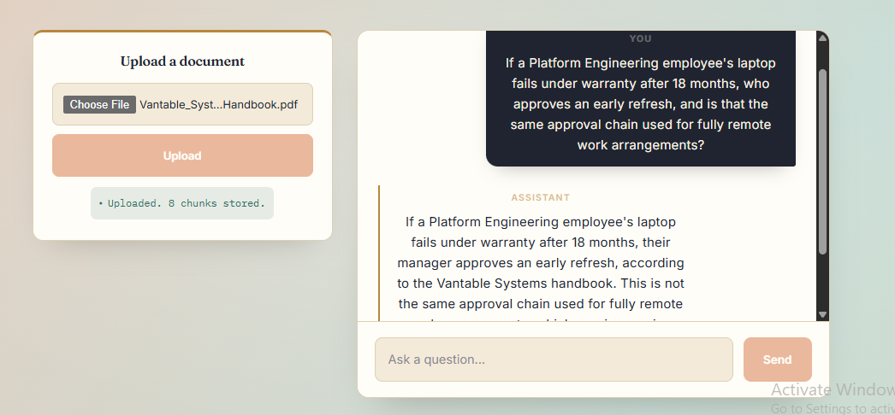
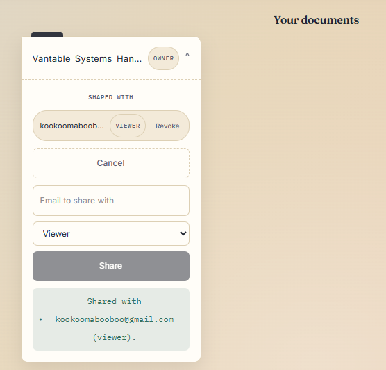
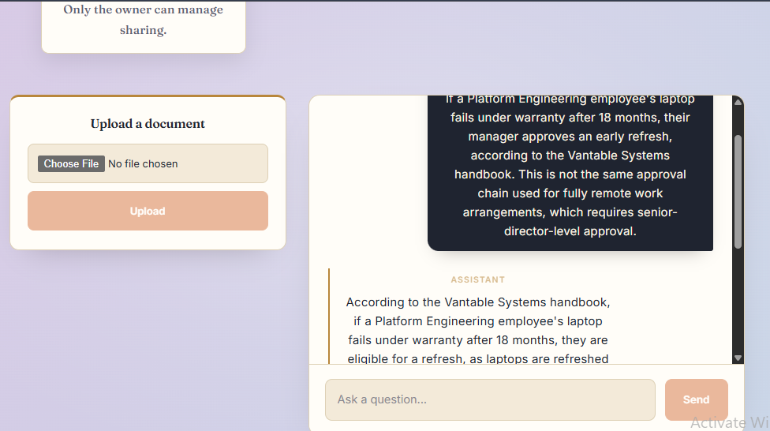
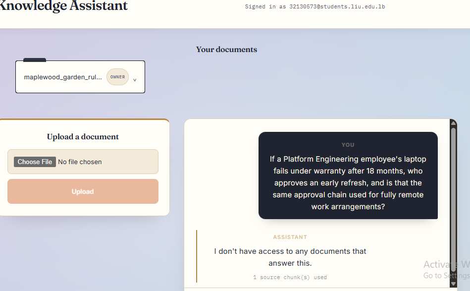
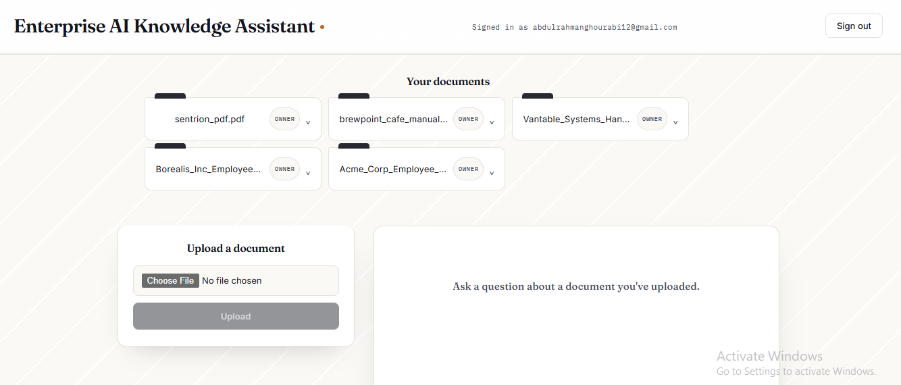
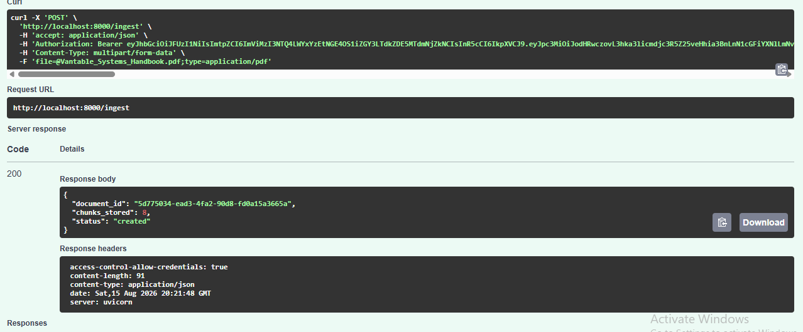

# Permission-Aware AI Agent

A RAG-based AI assistant that answers questions from your documents while respecting user-level permissions — users only get answers grounded in documents they're allowed to access.

## Tech Stack

**Backend**
- FastAPI (Python)
- PostgreSQL + pgvector (via Supabase)
- Sentence Transformers (embeddings) + Cross-Encoder (reranking)
- Groq (LLM inference)
- JWT auth via Supabase JWKS

**Frontend**
- React 19 + Vite
- Supabase JS client

## Setup

### Backend
```bash
cd ai-agent-backend
python -m venv venv
source venv/bin/activate  # or venv\Scripts\activate on Windows
pip install -r requirements.txt
cp .env.example .env   # then fill in your own values
python setup_db.py
uvicorn main:app --reload
```

### Frontend
```bash
cd ai-agent-frontend
npm install
npm run dev
```

## Environment Variables

See `ai-agent-backend/.env.example` for required variables:
- `DATABASE_URL` — Supabase Postgres connection string
- `GROQ_API_KEY` — Groq API key for LLM calls
- `SUPABASE_JWKS_URL` — Supabase JWKS endpoint for verifying auth tokens

## Features

- Document upload and ingestion (PDF parsing, chunking, embedding)
- Permission-aware retrieval — users only see results from documents they can access
- Chat interface backed by RAG over ingested documents
- JWT-based authentication via Supabase
- Document sharing and access revocation between users

## Screenshots

**Login**


**Chat — asking a question as the document owner**


**Document sharing and revocation**


**Viewer with granted access**


**Third user without access — correctly blocked**


**All documents view**


**Backend — document ingestion endpoint**


**Backend — retrieval debug (permission-filtered retrieval)**
.png)
.png)
